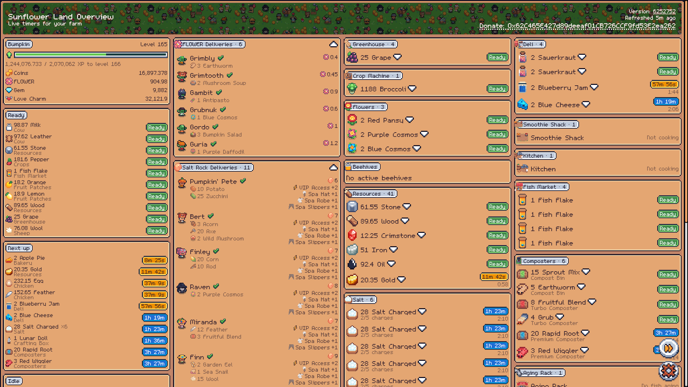
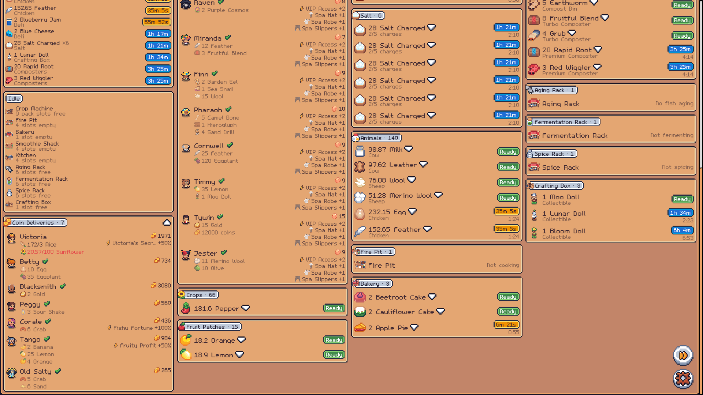

# Sunflower Land Overview

[](https://github.com/eliasSFL/sunflower-land-overview/actions/workflows/pr-validation.yml)
[](LICENSE)

A community tool that shows **live timers** for your Sunflower Land farm — crops, fruit, greenhouse, cooking, composters, animals, beehives, deliveries, and bounties — all in one place.

> ⚠️ **Personal project by a Sunflower Land team member.** Not officially endorsed, supported, or maintained by Sunflower Land. Data is read from the official public Community API.
>
> 🌻 **Try it live:** https://sfl-overview.com/

<p align="center">
  
</p>
<p align="center">
  
</p>

## Features

- **Live timers** across every major farm activity — crops, fruit, greenhouse, cooking, composters, animals, beehives, deliveries, bounties.
- **Push notifications** — opt in by category and get pinged the moment something's ready.
- **Multi-farm friendly** — switch between farms you maintain.
- **Auto-refresh** — timers update on their own; a floating button forces an immediate fetch.
- **Key-less in the browser** — the SPA never holds an API key, so there's no surface to leak from your device.

## Usage

1. Open the app and enter your **Farm ID** (the number next to your name in the main game).
2. Timers refresh automatically; the floating refresh button forces an immediate fetch.
3. Optional: open Settings → **Notifications** to subscribe to push notifications when timers come due, and pick which categories you want to be notified about.

### Data handling

- Your Farm ID is stored in `localStorage` on **your device only**.
- If you opt into push notifications, the subscription endpoint is stored server-side so the Worker can deliver them; it's removed when you unsubscribe.
- The browser **never sends an API key**. The Cloudflare Worker mints a per-farm community key from a server-side HMAC secret on every request.
- For security reports see [SECURITY.md](SECURITY.md).

## How it works

A quick map for the curious:

1. **SPA** — Vite + React 19 + TypeScript + Tailwind v4. A service worker via `vite-plugin-pwa` handles push delivery and notification clicks ([`src/sw.ts`](src/sw.ts)).
2. **Cloudflare Worker** sits between the SPA and the Sunflower Land Community API. It signs API requests with a server-side HMAC secret, holds per-farm state in a Durable Object, and tracks push opt-ins in a D1 table.
3. **Cron sweep** — a 10-minute cron in the Worker checks for timers coming due and sends Web Push notifications to opted-in devices.
4. **Game logic bridge** — the [`sunflower-land/`](https://github.com/sunflower-land/sunflower-land) repo is included as a git submodule and bumped daily by [an automated workflow](.github/workflows/bump-sunflower-land-submodule.yml). The dashboard's yield and timer math is computed by calling upstream functions directly, so estimates stay correct as the game changes — see [the contributor rule](CONTRIBUTING.md#never-replicate-functions-from-the-submodule).

## Contributing

PRs welcome! See [CONTRIBUTING.md](CONTRIBUTING.md) for the full guide. Short version:

- **Bug fixes** of any size — open a PR directly.
- **New features** that fit the dashboard vision — issue first for non-trivial work.
- **Never replicate game logic** from the `sunflower-land/` submodule into our code. Call upstream functions directly. This is the project's most important rule.

Community guidelines are in [CODE_OF_CONDUCT.md](CODE_OF_CONDUCT.md). For casual chat about the tool, find the [Sunflower Land Discord](https://discord.gg/sunflowerland).

## Security

Found a vulnerability? Please report it privately. See [SECURITY.md](SECURITY.md) for the reporting process and what's in scope.

## Run locally

You need **two** processes running side-by-side: the Vite dev server (SPA) and `wrangler dev` (the Cloudflare Worker, which handles `/api/farms/:id` and `/push/*`). Vite proxies those paths to `localhost:8787` ([`vite.config.ts`](vite.config.ts)).

> **Just want the UI?** Set `VITE_OFFLINE_FARM=true` in `.env` and run `npm run dev` on its own — no Worker, no `wrangler`, no API key. `fetchFarm` serves a static farm snapshot ([`src/api/offlineFarm.snapshot.json`](src/api/offlineFarm.snapshot.json)) with its timers rebased to "now", and the dashboard auto-loads it. Ideal for working on panels, layout, and timers. Push notifications and live refresh are no-ops in this mode. See [`src/api/offlineFarm.ts`](src/api/offlineFarm.ts). Everything below is for the full Worker-backed setup.

### 1. Clone with the game submodule

The game source ([sunflower-land](https://github.com/sunflower-land/sunflower-land)) is a git submodule at [`./sunflower-land/`](sunflower-land/), tracking `main`. The yield/timer extractors in [`src/timers/`](src/timers/) and [`src/game/`](src/game/) import its harvest functions directly so estimates match what the game would compute.

```sh
git clone --recurse-submodules https://github.com/eliasSFL/sunflower-land-overview.git
cd sunflower-land-overview
npm install
```

If you cloned without `--recurse-submodules`:

```sh
git submodule update --init --remote --depth 1
```

To pull the latest upstream `main` later:

```sh
git submodule update --remote --depth 1 -- sunflower-land
```

### 2. Configure environment

Two files, both gitignored:

```sh
cp .env.example .env             # Vite (client) — CDN + network
cp .dev.vars.example .dev.vars   # Wrangler (worker) — secrets
```

- `.env` — only needed if you want to override the asset CDN or talk to testnet.
- `.dev.vars` — the Worker reads this automatically. The two things that matter for local dev:
  - `SFL_COMMUNITY_API_KEY` — master HMAC secret used to mint per-farm community keys for `/api/farms/:id`. Without it, farm fetches return 503. For local-only experimentation you can paste a single-farm community key (in-game **Settings → Developer Options → API Key**); the Worker auto-detects that shape and uses it as-is, scoped to that one farm.
  - `VAPID_PUBLIC` / `VAPID_PRIVATE` — only needed if you want to test push notifications. Generate a _local_ keypair with `npx web-push generate-vapid-keys --json` (don't reuse the prod keys — the public key is baked into each device's subscription, so mixing dev/prod will break pushes).
  - `ADMIN_SECRET` — gates `POST /push/sweep` (manual Coordinator trigger). Only needed if you want to fire a sweep on demand locally; the cron path doesn't go through this check. Generate with `openssl rand -hex 32`. In production set it with `wrangler secret put ADMIN_SECRET`. Without it on the env, the endpoint fails closed (403).

### 3. Start the three dev processes

```sh
# terminal 1 — Worker on :8787 (serves dist-worker/index.js, hot-reloads on rebuild)
npm run wrangler

# terminal 2 — SPA on :3000
npm run dev

# terminal 3 — rebuild the Worker bundle on every save
npm run worker
```

Open <http://localhost:3000>. API calls (`/api/farms/:id`, `/push/*`) are forwarded to the Worker by the Vite proxy.

> Why three terminals? `wrangler.jsonc`'s `main` points at the pre-built `dist-worker/index.js`. Wrangler can't run `worker/index.ts` directly because the Worker bundle relies on the path aliases, asset-CDN plugin, and submodule stubs in [`vite.worker.config.ts`](vite.worker.config.ts). `npm run worker` (a `vite build --watch`) rebuilds that bundle on save, and `wrangler dev` hot-reloads when the file changes. For a one-shot session you can skip terminal 3 and just `npm run build:worker` manually after each Worker edit.

### Smoke-testing without setting up push

Hit the Worker directly:

```sh
curl http://localhost:8787/api/farms/<your-farm-id>
curl -X POST http://localhost:8787/push/categories \
  -H 'content-type: application/json' \
  -d '{"farmId":1,"endpoint":"https://example/x","mutedCategories":["Crops"]}'
```

A `404 Unknown endpoint` from the categories call means the route is wired correctly — there's just no subscription registered for that fake endpoint.

## Build

```sh
npm run build      # builds both the SPA (dist/) and the Worker (dist-worker/)
npm run preview    # build + `wrangler dev` against the built bundle
```

## Adding new timers

Each category has its own extractor in [`src/timers/`](src/timers/) (e.g. [`crops.ts`](src/timers/crops.ts), [`beehives.ts`](src/timers/beehives.ts)). Add a function that returns `Timer[]` and wire it into [`src/timers/index.ts`](src/timers/index.ts); the UI will pick it up via `CATEGORY_ORDER` automatically. See [CONTRIBUTING.md](CONTRIBUTING.md#never-replicate-functions-from-the-submodule) for the rule about calling upstream helpers directly rather than re-implementing yield math.

## License

[MIT](LICENSE). This license covers only the code in this repository; the [`sunflower-land/`](sunflower-land/) submodule is governed by its own separate terms.
